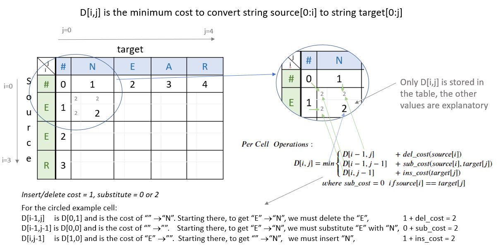

# Auto-Correct System

Create an auto-correct model similar to the one explained by Peter Norvig in his 2007 article.

For example, if you type in the word **"I am lerningg"**, chances are very high that you meant to write **"learning"**.

## Edit Distance

Implement models that correct words that are 1 and 2 edit distances away. We say two words are `n` edit distance away from each other when we need `n` edits to change one word into another. An edit could consist of one of the following options:

- **Delete** (remove a letter): `hat` => `at, ha, ht`
- **Switch** (swap 2 adjacent letters): `eta` => `eat, tea,...`
- **Replace** (change 1 letter to another): `jat` => `hat, rat, cat, mat, ...`
- **Insert** (add a letter): `te` => `the, ten, ate, ...`

Compute probabilities that a certain word is correct given an input. This auto-correct model was originally made in 2007 (https://norvig.com/spell-correct.html).

The goal of this spell-check model is to compute the following probability:

\[ P(c|w) = \frac{P(w|c) \times P(c)}{P(w)} \]

Bayes Rule - (https://en.wikipedia.org/wiki/Bayes%27_theorem)

## get_count

Implement a `get_count` function that returns a dictionary where:
- The dictionary's keys are words.
- The value for each word is the number of times that word appears in the corpus.

For example, given the following sentence: **"I am happy because I am learning"**, your dictionary should return the following:

| Key       | Value |
|-----------|-------|
| I         | 2     |
| am        | 2     |
| happy     | 1     |
| because   | 1     |
| learning  | 1     |

## get_probs

Given the dictionary of word counts, compute the probability that each word will appear if randomly selected from the corpus of words.

\[ P(w_i) = \frac{C(w_i)}{M} \]

where:
- \( C(w_i) \) is the total number of times \( w_i \) appears in the corpus.
- \( M \) is the total number of words in the corpus.

For example, the probability of the word 'am' in the sentence **'I am happy because I am learning'** is:

\[ P(am) = \frac{C(w_i)}{M} = \frac{2}{7} \]

## String Manipulations

Implement four functions:
* `delete_letter`: given a word, it returns all the possible strings that have **one character removed**.
* `switch_letter`: given a word, it returns all the possible strings that have **two adjacent letters switched**.
* `replace_letter`: given a word, it returns all the possible strings that have **one character replaced by another different letter**.
* `insert_letter`: given a word, it returns all the possible strings that have an **additional character inserted**.

### delete_letter

**delete_letter()**: Implement a `delete_letter()` function that, given a word, returns a list of strings with one character deleted. 

For example, given the word **nice**, it would return the set: {'ice', 'nce', 'nic', 'nie'}. 

### switch_letter

**switch_letter()**: Implement a function that switches two letters in a word. It takes in a word and returns a list of all the possible switches of two letters **that are adjacent to each other**. 

For example, given the word 'eta', it returns {'eat', 'tea'}, but does not return 'ate'.

### replace_letter

**replace_letter()**: Implement a function that takes in a word and returns a list of strings with one **replaced letter** from the original word. 

### insert_letter

**insert_letter()**: Implement a function that takes in a word and returns a list with a letter inserted at every offset.

## Combining the Edits

Will return all the possible single and double edits on that string. These will be `edit_one_letter()` and `edit_two_letters()`.

### Edit One Letter

Implement the `edit_one_letter` function to get all the possible edits that are one edit away from a word. The edits consist of the replace, insert, delete, and optionally the switch operation. The 'switch' function is a less common edit function, so its use will be selected by an "allow_switches" input argument.

### Edit Two Letters

Implement the `edit_two_letters` function that returns a set of words that are two edits away. This is done by first generating all possible edits on a single word and then modifying each resulting word again.

### Suggest Spelling Suggestions

Use `edit_two_letters` function to get a set of all the possible 2 edits on your word. Use those strings to get the most probable word you meant to type, i.e., your typing suggestion.

### get_corrections

Implement `get_corrections`, which returns a list of zero to `n` possible suggestion tuples of the form (word, probability_of_word). 

**Step 1:** Generate suggestions for a supplied word:
* If the word is in the vocabulary, suggest the word.
* Otherwise, if there are suggestions from `edit_one_letter` that are in the vocabulary, use those.
* Otherwise, if there are suggestions from `edit_two_letters` that are in the vocabulary, use those.
* Otherwise, suggest the input word.

## Minimum Edit Distance

Implement a dynamic programming system that will tell the minimum number of edits required to convert a string into another string. Example: 'waht' to the word 'what'

### Dynamic Programming

Dynamic Programming breaks a problem down into subproblems which can be combined to form the final solution. Here, given a string `source[0..i]` and a string `target[0..j]`, compute all the combinations of substrings `[i, j]` and calculate their edit distance. To do this efficiently, use a table to maintain the previously computed substrings and use those to calculate larger substrings.

Create a matrix and update each element in the matrix as follows:  

**Initialization**

\[ D[0,0] = 0 \]

\[ D[i,0] = D[i-1,0] + del\_cost(source[i]) \]

\[ D[0,j] = D[0,j-1] + ins\_cost(target[j]) \]

**Per Cell Operations**

\[ D[i,j] = \min \begin{cases}
D[i-1,j] + \text{del\_cost} \\
D[i,j-1] + \text{ins\_cost} \\
D[i-1,j-1] + \left\{ \begin{matrix}
\text{rep\_cost} & \text{if src}[i] \neq \text{tar}[j] \\
0 & \text{if src}[i] = \text{tar}[j]
\end{matrix} \right.
\end{cases} \]

So converting the source word **play** to the target word **stay**, using an input cost of one, a delete cost of 1, and replace cost of 2 would give the following table:

|     |   # | s | t | a | y |
|-----|-----|---|---|---|---|
|  #  | 0   | 1 | 2 | 3 | 4 |
|  p  | 1   | 2 | 3 | 4 | 5 |
|  l  | 2   | 3 | 4 | 5 | 6 |
|  a  | 3   | 4 | 5 | 4 | 5 |
|  y  | 4   | 5 | 6 | 5 | 4 |

The minimum path from the lower right final position where "EER" has been replaced by "NEAR" back to the start provides a starting point for the optional 'backtrace' algorithm. Get the minimum amount of edits required given a source string and a target string.

 Initializing Distance Matrix

Filling in the remainder of the table utilizes the 'Per Cell Operations'. Only the 'min' of operations is stored in the table in the `min_edit_distance()` function.

 Examples Distance Matrix

The variable `sub_cost` (for substitution cost) is the same as `rep_cost`; replacement cost.

The minimum path from the lower right final position where "EER" has been replaced by "NEAR" back to the start provides a starting point for the optional 'backtrace' algorithm. Get the minimum amount of edits required given a source string and a target string.

Autocorrect Model Demo:
 Output

---